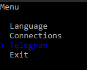
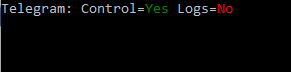

# 连接设置

除[通过 Designer 导出设置](export_from_designer.md)外，**Runner** 还支持通过控制台界面配置程序。为此，请使用 **setup** 命令启动程序：

```cmd
stocksharp.studio.runner setup
```

程序将显示菜单：


选择连接后，程序将进入连接器设置模式：


可以编辑已保存的连接，也可以创建新连接：


选择所需的新连接类型后，程序将打开其设置编辑菜单：


对于 [Binance](../api/connectors/crypto_exchanges/binance.md)，需要输入主要设置：


要验证输入数据是否正确，请选择 **检查**：


程序将开始检查连接：


检查成功后会显示相应消息：


输入并验证所有设置后，必须单击 **保存**：


程序将在 Data 文件夹中创建 **connector.json** 文件（如果该文件尚不存在），并将设置保存到其中。

要设置与 [Telegram](../telegram_services.md) 的集成，请选择对应菜单项：



然后选择方便的方式完成身份验证：


使用令牌进行身份验证时，请输入从 [https://stocksharp.com/zh/profile/](https://stocksharp.com/zh/profile/) 获取的令牌：


验证成功后，程序将显示可用的 Telegram 操作选项：


