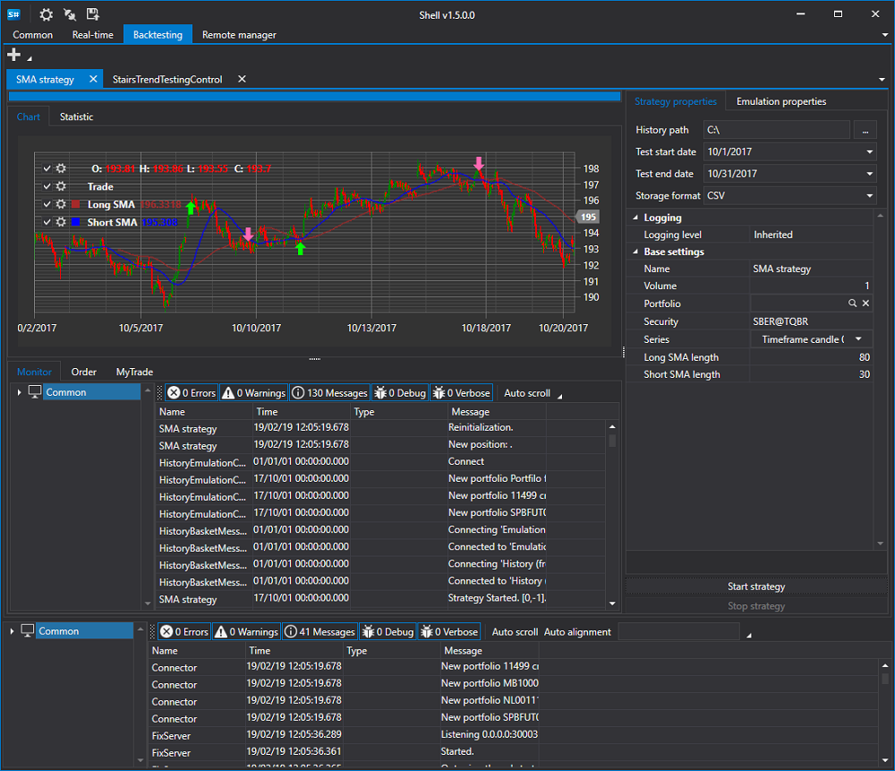

# Shell

**Shell** 是一个现成的图形应用框架，可以快速按需修改，并提供完全开放的 C# 源代码，只需具备基本的 C# 知识即可使用。

您无需再花时间从头创建 GUI（图形用户界面），因此可以更快地完成交易机器人的开发，同时不牺牲应用程序的易用性。测试、交易、连接数据源，以及显示图表、投资组合、持仓、订单和成交等基础功能均已内置。

交易机器人 Shell 的主要功能包括：

1. 提供完整源代码，适合创建自定义交易机器人或集成到自己的解决方案中。
2. **支持 70 多个连接器，可连接全球不同的交易所和经纪商**，详见[连接器](api/connectors.md)。
3. 用户界面可灵活定制。
4. 支持策略测试，包括统计数据、资金曲线和报告。
5. 支持保存和恢复策略设置。
6. 支持同时运行多个策略。
7. 提供策略运行的详细信息，包括订单、成交、持仓、收益和日志等，界面清晰直观。
8. 支持按计划运行策略。

## 推荐内容

[安装 Shell](shell/installing_shell.md)
