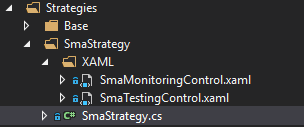
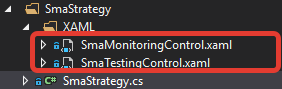

# 创建策略

要创建自己的策略，请在 Strategies 文件夹中为该策略新建一个文件夹。



下面以 SmaStrategy 为例创建策略本身。

如果需要为策略添加自定义测试面板或监控面板，则策略必须分别实现 IHaveTestControl 和 IHaveMonitoringControl 接口。

```cs
public class SmaStrategy : Strategy, IHaveMonitoringControl, IHaveTestControl
	{
	...
		#region MonitoringControl
				public BaseStudioControl AddMonitoringPanel()
		{
			var usercontrol = new SmaMonitoringControl();
			usercontrol.Init(this);
			return usercontrol;
		}
		#endregion
		#region TestingControl
		public BaseStudioControl AddTestPanel()
		{
			var usercontrol = new SmaTestingControl();
			usercontrol.Init(this);
			return usercontrol;
		}
		#endregion
	...	
	}
		
```

还需要创建面板本身。有关如何构建自定义测试面板或监控面板，请参阅[创建策略面板](create_strategy_panel.md)。

> [!TIP]
> 如果默认策略使用的测试面板或监控面板已经能够满足该策略的需要，则无需实现 IHaveTestControl 和 IHaveMonitoringControl 接口。Shell 会自行加载默认测试面板或监控面板。



要让新建的策略出现在策略选择窗口中，必须将其添加到主窗口的 **DictionaryStrategies** 字典。

```cs
	...
	//---------------------------------------------------------------------
	DictionaryStrategies = new ObservableDictionary<Guid, Strategy>
	{
		{ new SmaStrategy().GetTypeId(), new SmaStrategy() },
		{ new StairsTrendStrategy().GetTypeId(), new StairsTrendStrategy() },
		{ new StairsCountertrendStrategy().GetTypeId(), new StairsCountertrendStrategy() }
	};
	//---------------------------------------------------------------------
	...	
		
```

为了保存并在之后加载策略，需要在策略构造函数中设置策略参数。

```cs
public class SmaStrategy : Strategy, IHaveMonitoringControl, IHaveTestControl
	{
	...
		public SmaStrategy()
		{
			...
			this.Param("TypeId", GetType().GUID);
			...
		}
	...	
	}
		
```

要保存其他字段，必须重写 **Load** 和 **Save** 方法。

```cs
public class SmaStrategy : Strategy, IHaveMonitoringControl, IHaveTestControl
	{
	...
		#region Load
		public override void Load(SettingsStorage storage)
		{
			base.Load(storage);
			try
			{
				_securityStr = storage.GetValue<string>(nameof(Security));
				_portfolioStr = storage.GetValue<string>(nameof(Portfolio));
				LongSmaLength = storage.GetValue<int>(nameof(LongSmaLength));
				ShortSmaLength = storage.GetValue<int>(nameof(ShortSmaLength));
				Series.CandleType = storage.GetValue(nameof(Series.CandleType), Series.CandleType);
				Series.Arg = storage.GetValue(nameof(Series.Arg), Series.Arg);
			}
			catch (Exception e)
			{
				e.LogError();
			}
		}
		#endregion
		#region Save
		public override void Save(SettingsStorage storage)
		{
			base.Save(storage);
			storage.SetValue(nameof(Security), Security?.Id);
			storage.SetValue(nameof(Portfolio), Portfolio?.Name);
			storage.SetValue(nameof(LongSmaLength), LongSmaLength);
			storage.SetValue(nameof(ShortSmaLength), ShortSmaLength);
			if (Series.CandleType != null)
				storage.SetValue(nameof(Series.CandleType), Series.CandleType.GetTypeName(false));
			if (Series.Arg != null)
				storage.SetValue(nameof(Series.Arg), Series.Arg);
		}
		#endregion
	...	
	}
		
```

## 推荐内容

[创建策略面板](create_strategy_panel.md)
