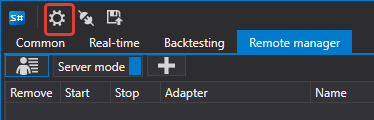
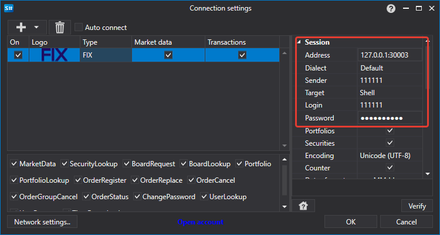
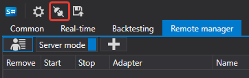
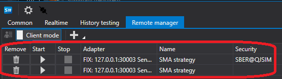

# RemoteManager

在 **RemoteManager** 选项卡中，可以启用远程控制模式。要启用此模式，首先打开用户配置菜单。


在打开的窗口中设置 **用户名** 和 **密码**。


然后启用**服务器模式**。


现在可以从另一个 Shell 连接到当前 Shell。

为此，请启动**另一个 Shell**，然后打开其中的连接设置。



在打开的窗口中配置 FIX 连接。



然后单击连接按钮。



连接成功后，Shell 服务器中的所有现有策略都会出现在 Shell 客户端中。



单击添加按钮，可以添加另一个用于交易的策略。


由于 Shell 客户端支持连接多个服务器，添加策略时必须先在左侧选择服务器。该服务器上的所有可用策略会显示在右侧。


添加策略后，它会出现在策略列表中。


选择策略后，右侧会显示策略设置和统计数据等选项卡。

修改策略设置后，务必单击应用更改按钮，否则更改不会应用到策略。


如果策略除了 Start\/Stop 之外还支持其他命令，则需要在下一个字段中指定该命令。


然后单击发送命令按钮。

要在策略中实现自定义命令，需要重写 [Strategy.ApplyCommand](xref:StockSharp.Algo.Strategies.Strategy.ApplyCommand(StockSharp.Messages.CommandMessage))**(**[StockSharp.Messages.CommandMessage](xref:StockSharp.Messages.CommandMessage) cmdMsg **)** 方法。

```cs
public virtual void ApplyCommand(CommandMessage cmdMsg)
		
```

[Strategy](xref:StockSharp.Algo.Strategies.Strategy) 基类只负责控制策略的启动和停止。

## 推荐内容

[连接设置](../connections_settings.md)
