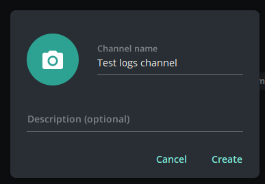
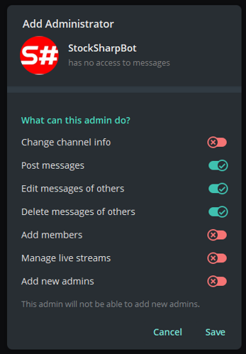

# 通知

该服务用于将应用程序（例如 [Designer](../designer.md) 或自行开发的程序）发出的消息发送到 Telegram 中的私人或公开频道及群组。

配置步骤：

1. 完成[机器人授权流程](authorization.md)。

2. 创建私人或公开频道或群组。

   
   

3. 添加机器人 [StockSharpBot](https://t.me/StockSharpBot)。

   

4. 将其设为管理员。

   

5. 为保证服务正常运行，请授予必要权限。

   

6. 在频道或群组中发送特殊单词 **activate**。

   

7. 激活成功后，您会收到回复。

   

现在，您创建的频道已经可以供策略和交易机器人使用：

  - 使用 [Designer](../designer.md) 时，单击顶部面板中的频道列表：

  

  打开的窗口会列出所有已激活机器人的频道和群组：

  

  单击 Telegram 图标按钮会发送一条测试消息。能够收到该消息，即表示配置正确。

  

  *使用免费套餐时，消息中会附加一行 StockSharp 网站说明；付费套餐不会添加该说明。*

如果 Telegram 中配置了多个输出频道，并希望将不同策略的消息发送到不同频道，可以在每个策略的设置中分别指定频道：

- 其他程序的配置方式与 [Designer](../designer.md) 类似。例如，如果 [Hydra](../hydra.md) 部署在服务器上，可以在 [Hydra](../hydra.md) 中配置市场数据下载错误日志，以便在连接停止工作时及时收到通知。
- 对于 [Shell](../shell.md) 或 [S#](../api.md)，可以查看将策略与 Telegram 服务集成的代码。
