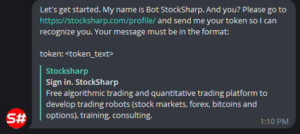

# 授权

要激活 [StockSharpBot](https://t.me/StockSharpBot)，请先启动机器人并完成授权，使其能够识别您在 StockSharp 网站上的账户。为此，请在菜单中选择 **/login** 命令：

机器人会要求您打开个人资料页面 [https://stocksharp.com/profile/](https://stocksharp.com/profile/)，并复制其中的令牌。

然后在聊天中按 **token: %your_token%** 格式将令牌发送给机器人。授权成功后，机器人会使用您在 StockSharp 网站注册时填写的姓名与您交流。

