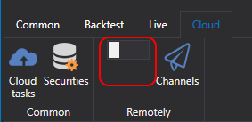

# 控制面板

该服务用于通过 Telegram 机器人管理交易策略和交易机器人。

配置前，请先完成[机器人授权流程](authorization.md)。

授权完成后即可使用机器人。为了让机器人识别您的策略，还需要执行以下操作：

 - 使用 [Designer](../designer.md) 时，在云面板中启用远程模式：

  

  所有以 Live 模式运行的策略都会自动传送到 Telegram 机器人，之后即可通过手机进行控制。

  在 [StockSharpBot](https://t.me/StockSharpBot) 中选择 /apps 命令，查看所有程序的列表：

  

  选择所需程序后，可以查看其中的策略及其控制项：

  

  

  

 - 使用 [Shell](../shell.md) 时，打开 RemoteManager 面板，并按与 [Designer](../designer.md) 类似的方式配置设置。
 - 使用 [Hydra](../hydra.md) 时，执行与 [Designer](../designer.md) 类似的操作。通过与 [Hydra](../hydra.md) 集成，可以管理市场数据下载并监控数量统计信息。

  
  

 - 使用 [S#](../api.md) 时，可以参考 [Shell](../shell.md) 中的代码完成集成。由于 [S#](../api.md) 支持跨平台运行，您的交易机器人可以在任意操作系统上运行。
