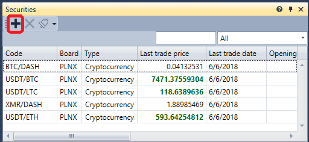

# 快速入门

首次启动 [Terminal](../terminal.md) 时，会显示以下窗口：

请选择启动模式，然后单击 **确定**。

选择启动模式后，Terminal 窗口会使用默认组件集打开。

首先打开连接设置并选择所需连接。有关连接配置方法，请参阅[连接设置](connection_settings.md)。

下一步，单击 **连接** 按钮  建立连接。

单击图表面板上的 **添加** 按钮 ，添加新的图表区域。右键单击图表区域，可以为所需交易品种添加K线。还可以向图表添加指标、自有成交和订单，并直接从图表登记订单。有关图表操作的详细信息，请参阅[图表](user_interface/components/chart.md)。

单击交易品种面板上的 **添加** 按钮 ，添加希望监控的交易品种。该面板会显示最优价格数据。有关交易品种面板的详细信息，请参阅[交易品种](user_interface/components/instruments.md)。

在订单簿中单击 **设置** 按钮 ，会出现一个设置面板，可以在其中指定用于交易的 **交易品种** 和 **投资组合**，也可以调整订单簿深度。有关订单簿操作的详细信息，请参阅[订单簿](user_interface/components/order_book.md)。

现在可以登记最初的几笔订单。既可以单击 **买入/卖出** 按钮登记订单，也可以单击订单簿中 **买价/卖价** 列的单元格。订单面板会显示您的全部订单。右键单击某个订单时，会出现一个面板，可用于提交新订单、撤销订单或修改所选订单。有关订单面板的详细信息，请参阅[订单](user_interface/components/orders.md)。

在成交面板中，可以按交易品种查看成交。有关成交面板的详细信息，请参阅[成交](user_interface/components/trades.md)。

如有需要，还可以添加其他组件。所有组件均在[组件](user_interface/components.md)中进行了说明。

