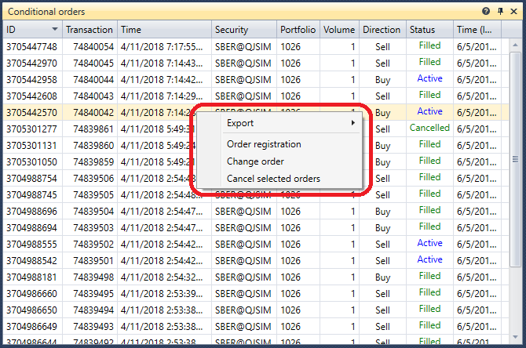
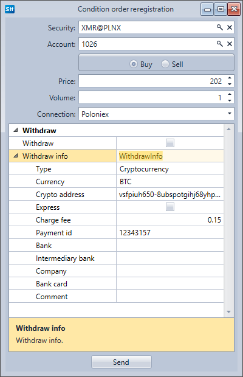

# 条件订单

**条件订单** 组件是一个订单表格，用于显示全部条件订单的详细信息。右键单击某个订单时，会出现一个面板，可以通过该面板登记新的条件订单、撤销订单或修改所选条件订单。

单击 **订单登记** 按钮后会出现一个窗口。要登记新的条件订单，请填写该窗口并单击 **发送** 按钮。

单击 **修改订单** 按钮后会出现一个窗口。要修改条件订单，请完成所需更改并单击 **发送** 按钮。

## 推荐内容

[成交](../../../designer/user_interface/components/trades.md)
