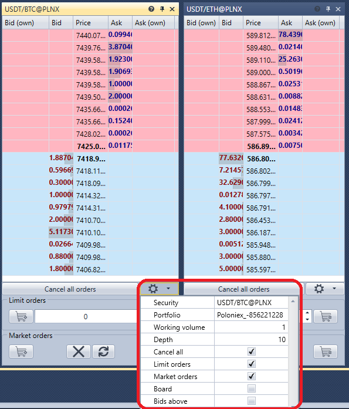

# 订单簿

**Order book** 组件是显示买卖限价订单的表格。

单击设置按钮  后，会出现一个面板，可以在其中指定所需的交易品种和投资组合，并配置订单簿的显示选项。

既可以单击 **Buy/Sell** 按钮登记订单，也可以单击订单簿中 **Bid/Offer** 列的单元格。

## 推荐内容

[持仓](../../../designer/user_interface/components/positions.md)
