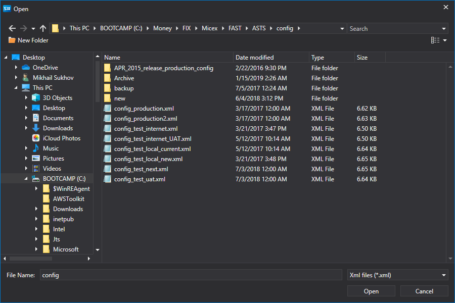
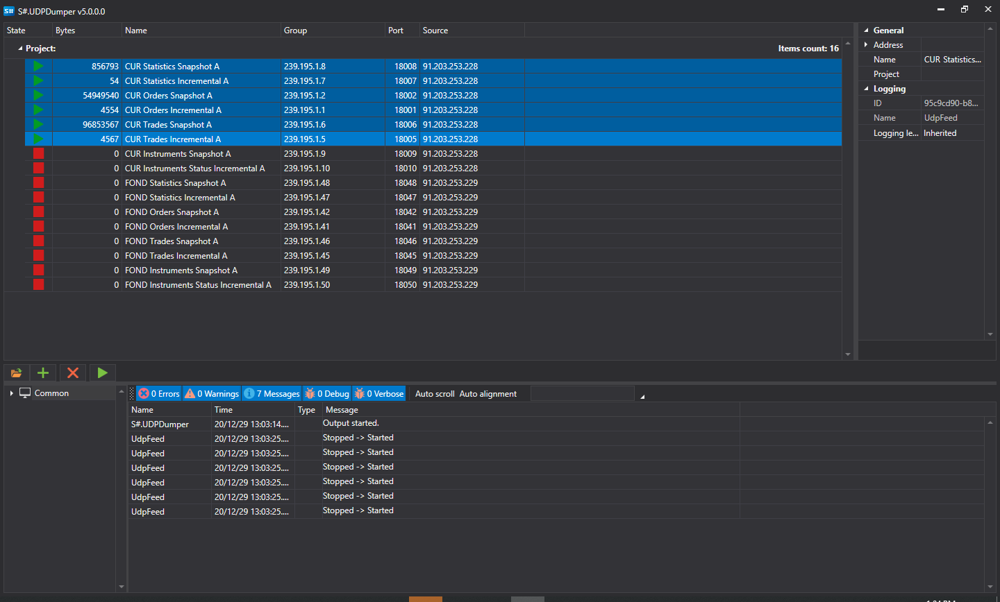

# UDP Dumper

**UDPDumper** 应用程序用于收集 UDP 数据包。借助该程序，可以检查经纪商或交易所提供的网络设置是否有效，也可以收集数据，以便后续测试基于 UDP 的连接器，例如 [FAST](api/connectors/common/fast_protocol.md) 或 SBE。

请使用[安装程序](installer.md)进行安装。

## 设置和运行

1. 首次启动时，应用程序会显示以下界面：
2. 添加网络数据流时，既可以手动添加，也可以从交易所配置文件中自动加载全部数据流。为此，请单击以下按钮：
3. 在打开的窗口中找到所需的交易所配置文件并将其打开：
4. 程序会从文件中加载所有数据流及其 IP 地址和端口设置：
5. 选择所需的数据流，然后单击开始下载按钮：
6. 如果设置正确，程序将开始接收 UDP 数据报并将其写入磁盘，同时显示每个数据流已接收的字节数：

   > [!CAUTION]
   > 如果设置正确，程序将开始接收 UDP 数据报并将其写入磁盘。应用程序会显示每个数据流已接收的字节数。
7. **UDPDumper** 提供图形用户界面。如果需要在没有图形界面的环境中运行程序，例如 Linux 操作系统，可以使用 **UDPDumper.Console**。它是控制台版本，同时支持跨平台运行。

   **UDPDumper.Console** 接收由图形界面版本创建的文件路径作为参数。必须使用图形界面版本生成的文件，**不能使用交易所配置文件**：

   ```cs
   		StockSharp.UdpDumper.Console.exe settings.json
   		
   ```
8. 要使用已收集的数据测试连接器，可以启用转储模式。有关详细信息，请参阅[转储模式](api/connectors/common/fast_protocol/dump_mode.md)。
